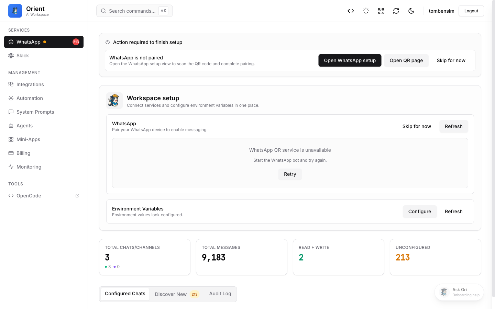

<p align="center">
  
</p>

<h1 align="center">Orient</h1>

<p align="center">
  <strong>Ask Ori. It acts.</strong><br/>
  An open-source AI agent that runs on your infrastructure and takes action for you.
</p>

<p align="center">
  <a href="https://github.com/orient-bot/orient/blob/main/LICENSE"></a>
  <a href="https://github.com/orient-bot/orient"></a>
  <a href="https://orient.bot"></a>
</p>

<p align="center">
  <a href="#-features">Features</a> •
  <a href="#-quick-start">Quick Start</a> •
  <a href="#-documentation">Documentation</a> •
  <a href="#-platforms">Platforms</a> •
  <a href="#-contributing">Contributing</a>
</p>

---

<p align="center">
  
</p>

## ✨ Features

- **🤖 AI Agent** — Not just a chatbot. Ori understands context and takes action: scheduling meetings, updating Jira tickets, drafting docs.
- **📱 WhatsApp & Slack** — Chat naturally on your favorite messaging platforms with configurable permissions.
- **🔧 MCP Integration** — Access Orient's tools from your IDE via the Model Context Protocol.
- **📦 Mini-Apps Builder** — Create and host lightweight apps through conversation.
- **📅 Scheduler** — Set up recurring jobs and one-off tasks with natural language.
- **🔒 Self-Hosted** — Runs entirely on your infrastructure. Your data never leaves your control.

## 🚀 Quick Start

### Demo Mode (Fastest)

```bash
# Clone the repository
git clone https://github.com/orient-bot/orient.git
cd orient

# Start the demo
docker compose -f docker/docker-compose.demo.yml up -d
```

Open the QR UI at `http://localhost:4097/qr` and the dashboard at `http://localhost:4098`.

### Development Mode

```bash
# Check prerequisites and auto-fix issues
./run.sh doctor --fix

# Install dependencies and build packages
pnpm install
pnpm build:packages

# Start development (auto-creates .env from .env.example)
./run.sh dev
```

The development environment auto-configures on first run:

- `.env` is created from `.env.example` if missing
- Default credentials work with Docker infrastructure
- Setup wizard (at http://localhost:80) handles remaining configuration

Access points:

- **Dashboard**: http://localhost:80
- **WhatsApp QR**: http://localhost:80/qr/
- **OpenCode**: http://localhost:4099

### Production

```bash
cd docker
docker compose -f docker-compose.yml -f docker-compose.prod.yml up -d
```

See [Production Deployment](docs/deployment/production.md) for details.

## 📖 Documentation

| Topic                                                  | Description                           |
| ------------------------------------------------------ | ------------------------------------- |
| [Getting Started (Demo)](docs/getting-started-demo.md) | Quick demo with Docker                |
| [Getting Started (Dev)](docs/getting-started.md)       | Full development setup                |
| [LLM Onboarding](README.LLM.md)                        | Guide for AI agents setting up Orient |
| [Configuration](docs/configuration.md)                 | All configuration options             |
| [Skills](docs/skills.md)                               | Create custom skills                  |
| [Permissions](docs/permissions.md)                     | Chat permission system                |

### Integrations

| Integration      | Docs                                                                           |
| ---------------- | ------------------------------------------------------------------------------ |
| Slack            | [docs/integrations/slack.md](docs/integrations/slack.md)                       |
| WhatsApp         | [docs/integrations/whatsapp.md](docs/integrations/whatsapp.md)                 |
| Jira             | [docs/integrations/jira.md](docs/integrations/jira.md)                         |
| Google Workspace | [docs/integrations/google-workspace.md](docs/integrations/google-workspace.md) |

## 📱 Platforms

<table>
  <tr>
    <td align="center" width="25%">
      <strong>WhatsApp</strong><br/>
      Chat naturally from your phone
    </td>
    <td align="center" width="25%">
      <strong>Slack</strong><br/>
      Built into your team's workflow
    </td>
    <td align="center" width="25%">
      <strong>IDE / MCP</strong><br/>
      Access tools from your editor
    </td>
    <td align="center" width="25%">
      <strong>CLI</strong><br/>
      Terminal-native for power users
    </td>
  </tr>
</table>

## 🛠️ Available Commands

| Command                 | Description                       |
| ----------------------- | --------------------------------- |
| `./run.sh doctor`       | Check environment prerequisites   |
| `./run.sh doctor --fix` | Auto-fix issues where possible    |
| `./run.sh dev`          | Start development environment     |
| `./run.sh dev stop`     | Stop development services         |
| `./run.sh dev status`   | Show service status               |
| `./run.sh test`         | Run full Docker stack for testing |
| `./run.sh deploy`       | Deploy to production              |
| `./run.sh instances`    | List all running instances        |
| `./run.sh help`         | Show all available commands       |

## 🔒 Privacy & Security

- **Open-source** — MIT licensed, audit the code yourself
- **Self-hosted** — Deploy on your own servers
- **No telemetry** — We don't phone home
- **Full control** — Configure exactly what Orient can access

## 🤝 Contributing

We welcome contributions! See [CONTRIBUTING.md](CONTRIBUTING.md) for guidelines.

```bash
# Run tests
pnpm test

# Run linting
pnpm lint
```

## 📄 License

MIT — see [LICENSE](LICENSE) for details.

---

<p align="center">
  <strong>Built with ❤️ by the Orient community</strong><br/>
  <a href="https://orient.bot">orient.bot</a> •
  <a href="https://github.com/orient-bot/orient">GitHub</a>
</p>
